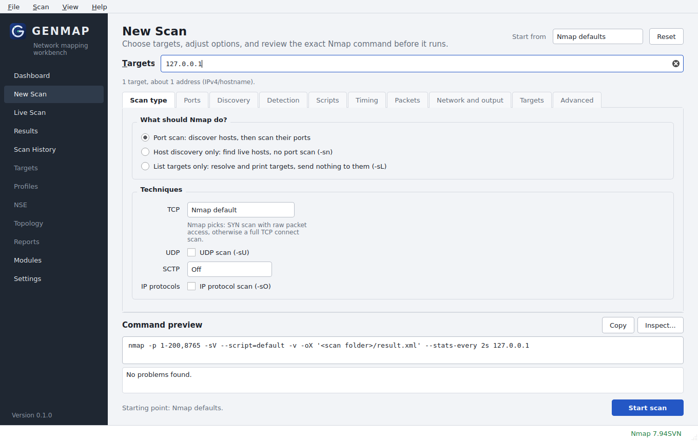
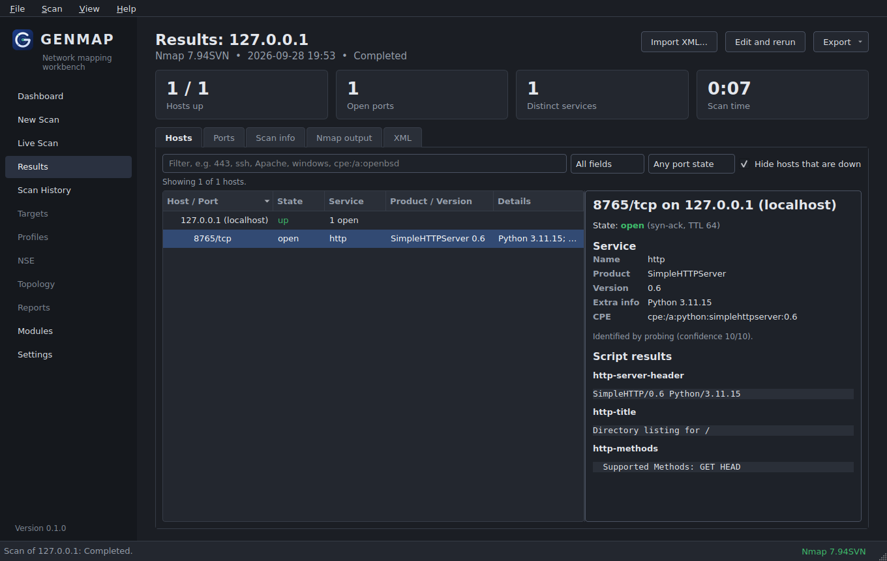
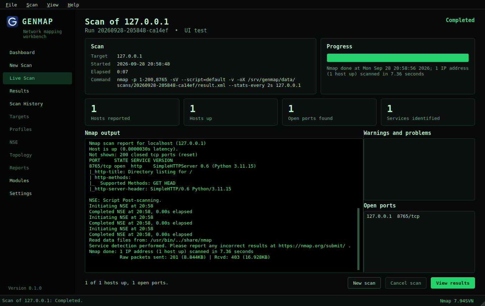
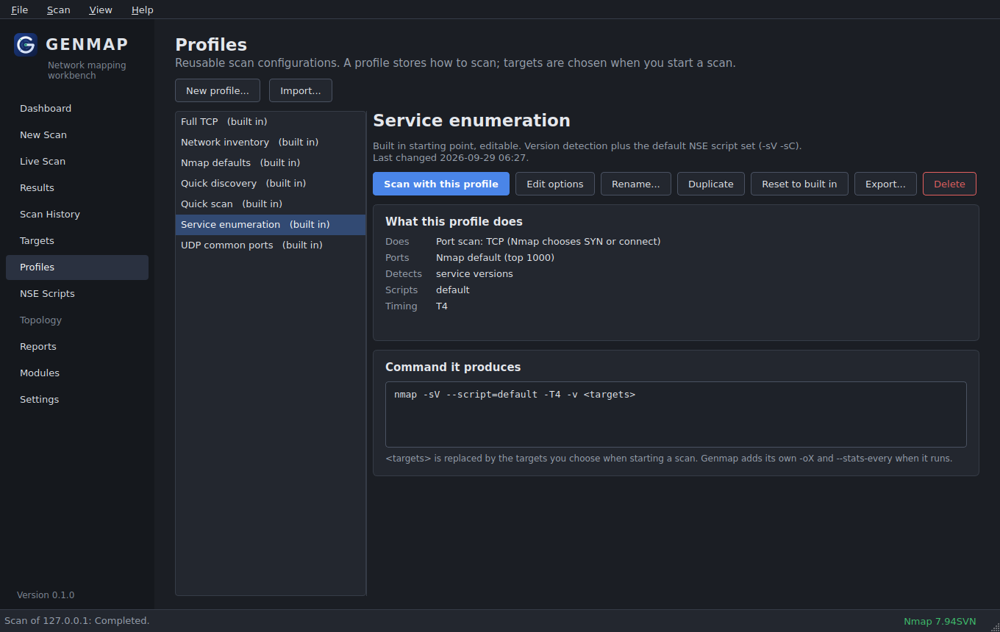
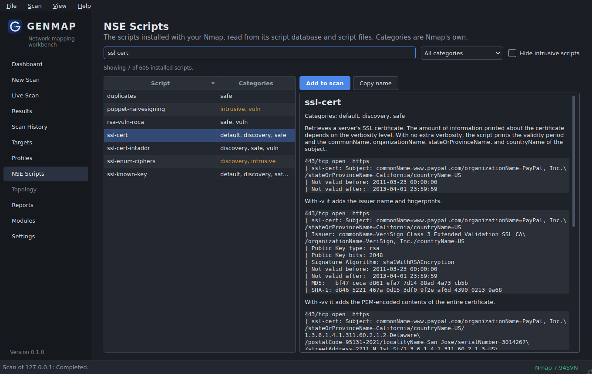

<p align="center">
  
</p>

<h1 align="center">Genmap</h1>

<p align="center">A desktop workbench for Nmap, built with Python and PyQt6. Windows first, portable where it counts.</p>

Genmap puts a proper desktop workflow around the Nmap you already have installed. You describe what you want to scan, Genmap shows you the exact command it will run, launches Nmap with it, follows the scan live, and stores the raw XML so you can browse, filter, export, and rerun later. Nmap stays the scanning engine. Genmap never reimplements scanning in Python and never invents results.



## What works today

Genmap has completed its first two development phases. Everything listed here is implemented, tested, and running against real Nmap:

* **Nmap detection.** Finds Nmap on PATH, through the Windows registry, or in the usual install folders, or uses a path you choose. Reads the version, build libraries, NSE script database, interfaces, and routes, and checks for Npcap and administrator rights.
* **Capability awareness.** Works out which scan types should work with your Nmap build, capture driver, and privileges, and explains anything that probably will not.
* **Structured scan configuration.** Every option lives in a typed `ScanConfiguration` model rather than a command string. It covers scan types, ports, host discovery, DNS, service and OS detection, NSE scripts and arguments, timing, packet options, interfaces, and output. Seven built in starting points ship as ordinary configurations.
* **Advanced arguments.** Anything without a dedicated control, including options from newer Nmap releases, can be typed as extra arguments. They are tokenised, checked, shown in the preview, and passed through untouched.
* **Command Inspector.** Shows the full command, every argument and where it came from, the working folder, and environment notes before anything runs.
* **Safe launch.** Nmap is started with an argument list and never through a shell. Script selections are resolved against the installed script database the way Nmap resolves them, so the warning names the exact scripts Nmap files as intrusive, brute, dos, exploit, fuzzer, or malware, and stays quiet when there are none. Spoofing, huge scopes, and random Internet targets also need explicit confirmation.
* **Live scan view.** Streams Nmap output and counts hosts, open ports, and services as Nmap reports them. Service names only count as identified when version detection confirmed them; names Nmap takes from its port table are labelled as such. Progress appears only when Nmap prints its own estimate. You can cancel at any point, and a time limit is available.
* **Results.** A secure XML parser produces normalised hosts, ports, services, CPEs, OS matches, uptime, traceroute, and NSE output, including structured script tables. Truncated files from cancelled scans are recovered. You can filter by host, port, protocol, state, service, product, version, OS, CPE, or NSE output, and export as the original XML, normalised JSON, or CSV.
* **Scan history.** Every run keeps its configuration, command, console output, and XML in its own folder, and a local SQLite database indexes the results. Search finds scans by target, discovered host name or address, command, profile, or tag. You can filter by status and tag, tag scans, open, rerun, edit a copy, report on, or delete them.
* **Profiles.** Reusable scan configurations with a plain language summary and the command they produce. Create them from the New Scan form, update them when you change options, and rename, duplicate, reset, import, or export them as JSON files. The seven built in starting points arrive as editable profiles.
* **Target groups.** Named lists of targets and exclusions, validated as you type, importable from and exportable to the one target per line format `nmap -iL` reads. Anything you scanned before is listed under *Recently scanned*, and New Scan can load or save a group in two clicks.
* **NSE browser.** All scripts installed with your Nmap, searchable by name, description, and argument, filterable by Nmap's categories, with the description, arguments, usage, and example output read from each script file. Intrusive categories are highlighted, and one click adds a script to the scan.
* **Reports.** Self contained HTML, JSON, CSV, or an exact copy of Nmap's XML, with scan details, configuration, hosts, ports, services, OS guesses, script output, and every warning. Reports describe what Nmap reported and never add risk ratings. HTML reports escape everything from the scanned systems and forbid scripts through a Content Security Policy.
* **Settings.** Covers general behaviour, appearance, Nmap, network, scanning, NSE, storage, reports, logging, and advanced options.
* **Themes.** Light, dark, following the Windows setting, and a black and green hacker theme with a monospace interface. Switch from **View, Theme** or **Settings, Appearance**.
* **Module system.** A versioned module contract, with Nmap as the first module, is ready for future tools.









## Planned

Features that are not built yet stay disabled in the sidebar until they are real:

* **Phase 3:** scan comparison, topology map from traceroute data, and module management.
* **Phase 4:** external modules, the Domain Atlas integration boundary, and correlation.

## Quick start

You need Windows 10 or 11 (Linux and macOS also work), Python 3.13, and Nmap 7.x. On Windows you also need Npcap, which the Nmap installer offers. See [INSTALLATION.md](INSTALLATION.md) for the details.

```powershell
git clone https://github.com/g33l0/genmap.git
cd genmap
py -3.13 -m venv .venv
.venv\Scripts\activate
pip install -e .
genmap
```

Then:

1. Type a target on the dashboard, for example `scanme.nmap.org` (the Nmap Project allows light scanning of it) or a host on your own network.
2. Pick a starting point and choose **Review and start**, or choose **Configure...** to adjust options first.
3. Check the command in the confirmation and start the scan.
4. Watch it on the Live Scan page, then open the results.

Useful command line switches:

```text
genmap --diagnose          print Nmap diagnostics and exit
genmap --open scan.xml     open an existing Nmap XML file
genmap --log-level DEBUG   verbose application log
genmap --self-test r.json  headless self test, writes a JSON report
```

## Authorized use only

Genmap is for authorized security testing, network administration, research, and lab work. Scanning networks without permission may be illegal where you live. You are responsible for how you use it.

## Documentation

* [INSTALLATION.md](INSTALLATION.md): requirements, Nmap and Npcap, running from source, building
* [ARCHITECTURE.md](ARCHITECTURE.md): layers, data flow, and key decisions
* [DEVELOPMENT.md](DEVELOPMENT.md): setting up, tests, code style, releasing
* [MODULES.md](MODULES.md): the module contract and how to add a tool
* [SECURITY.md](SECURITY.md): process execution, parsing, and data handling
* [TROUBLESHOOTING.md](TROUBLESHOOTING.md): common problems and fixes

## Third party software

Nmap and Npcap are separate products by the Nmap Project with their own licenses. Genmap does not bundle or redistribute them. Genmap is built on Qt and PyQt6; check their license terms before distributing builds.
